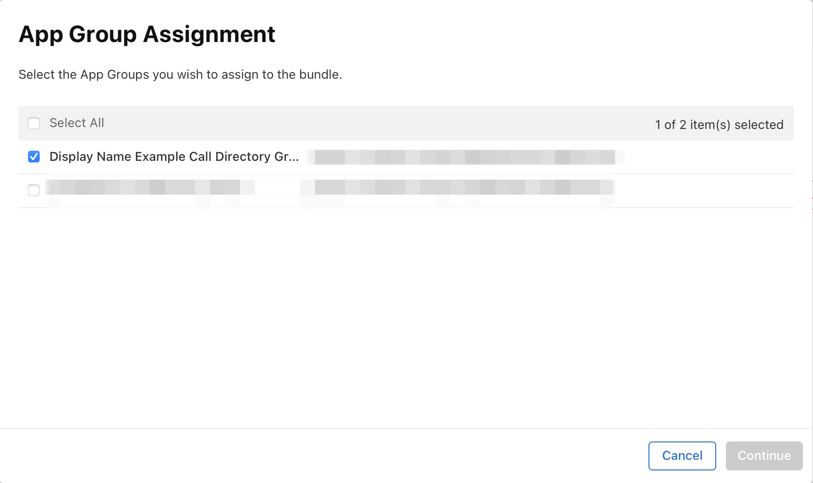

# iOSDC2021-Sample-CallKit
iOSDC2021冊子内記事 `Call Directory Extensionデバッグテクニック` のサンプルコードです。

# サンプルコードの内容

原稿内で使用したコードを含む、iOSアプリとして実行可能なサンプルが含まれています。

原稿の内容に関連するコードは `CallDirectoryExtension` ディレクトリ、および `CallDirectorySample/CallDirectory` ディレクトリに大半があります。

# 実行方法

## 必要なIdentifiersとProvisioning Profileの用意

### Identifiers情報

事前にApple Developer上で下記Identifiers情報を用意してください。

- アプリのIdentifier
- Call Directory ExtensionのIdentifier
- App GroupのIdentifier

上記が用意できたら、アプリ、Call Directory ExtensionのそれぞれのEdit your App ID Configuration画面で、App GroupのConfigureを選択し、用意したApp GroupのIdentifierを設定してください(下記スクリーンショット参照)。



### Provisioning Profileを生成する

アプリ、Call Directory ExtensionそれぞれについてProvisioning Profileを用意してください。

### Configurations.xcconfigに設定情報を追加する

リポジトリに含まれるConfigurations.xcconfigを開き、以下の設定情報を追加してください。なお、ダブルクォーテーション無しのIdentifierを設定してください。

- APP_GROUP_ID
  - App GroupのIdentifier情報を設定します。
- CALL_DIRECTORY_BUNDLE_IDENTIFER
  - Call Directory ExtensionのIdentifier情報を設定します。

設定例

```
APP_GROUP_ID = group.co.kotetu.example.hogehoge
CALL_DIRECTORY_BUNDLE_IDENTIFER = co.kotetu.example.hogehoge.calldirectory
```

# 動作環境

- 開発環境: Xcode 12.5.1
- Deployment Target: 14.1
- Call Directory Extensionの機能を利用するためには、実機でかつsimカードが搭載されている必要があります。
